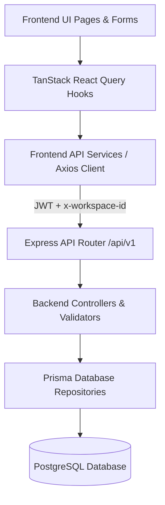

# End-to-End API Integration Plan

This plan details the step-by-step roadmap to integrate all frontend modules and UI pages with backend REST API endpoints (`/api/v1/*`), removing static mock data and resolving failing API requests.

---

## User Review Required

> [!IMPORTANT]
> **API Connection Prerequisites**:
> - Backend server running on `http://localhost:5000` (or `VITE_API_BASE_URL`).
> - PostgreSQL database connected via `DATABASE_URL` in `server/.env`.
> - Active workspace context header (`x-workspace-id`) attached to all API requests via Axios interceptor.

> [!WARNING]
> **Mock Data Fallbacks Removal**:
> As each module's API hooks are connected, static mock fallbacks will be systematically replaced with live API loading states, empty state banners, and error toast feedback.

---

## API Integration Architecture

---

## Proposed Changes & Module Breakdown

---

### Phase 1: Core Client & Workspace Context Integration

#### [MODIFY] [axios.ts](file:///d:/Imaz/Imaz%20Projects/Agent%20Builder/src/api/axios.ts)
- Attach `x-workspace-id` header dynamically from `sessionStorage` alongside `Authorization: Bearer <token>`.
- Add global 401 automatic token refresh retry logic.

#### [NEW] [useWorkspaceQueries.ts](file:///d:/Imaz/Imaz%20Projects/Agent%20Builder/src/hooks/queries/useWorkspaceQueries.ts)
- Create hooks for fetching user workspaces (`useWorkspacesQuery`) and current workspace details (`useWorkspaceDetailQuery`).

---

### Phase 2: Agent Management API Integration (`/api/v1/agents`)

#### [MODIFY] [agent.service.ts](file:///d:/Imaz/Imaz%20Projects/Agent%20Builder/src/services/agent.service.ts)
- Connect endpoints: `GET /agents`, `POST /agents`, `GET /agents/:id`, `PUT /agents/:id`, `DELETE /agents/:id`, `POST /agents/:id/clone`.

#### [MODIFY] [useAgentQueries.ts](file:///d:/Imaz/Imaz%20Projects/Agent%20Builder/src/hooks/queries/useAgentQueries.ts) & [useAgentMutations.ts](file:///d:/Imaz/Imaz%20Projects/Agent%20Builder/src/hooks/mutations/useAgentMutations.ts)
- Update query keys and mutation cache invalidation for instant UI updates on create/update/delete/clone.

#### [MODIFY] [AgentsPage.tsx](file:///d:/Imaz/Imaz%20Projects/Agent%20Builder/src/pages/AgentsPage.tsx)
- Replace static `mockAgents` with live `useAgentsQuery()`.
- Connect search bar, category filter, status toggle, and delete actions directly to backend mutations.

#### [MODIFY] [CreateAgentPage.tsx](file:///d:/Imaz/Imaz%20Projects/Agent%20Builder/src/pages/CreateAgentPage.tsx)
- Connect full multi-step agent creation form to `useCreateAgentMutation()` with toast notifications and automatic redirect to `/agents`.

---

### Phase 3: Knowledge Base RAG & Document API Integration (`/api/v1/knowledge`)

#### [MODIFY] [knowledge.service.ts](file:///d:/Imaz/Imaz%20Projects/Agent%20Builder/src/services/knowledge.service.ts)
- Connect endpoints: `GET /knowledge`, `POST /knowledge/upload` (multipart/form-data), `DELETE /knowledge/:id`, `POST /knowledge/:id/reindex`.

#### [MODIFY] [useKnowledgeQueries.ts](file:///d:/Imaz/Imaz%20Projects/Agent%20Builder/src/hooks/queries/useKnowledgeQueries.ts) & [useKnowledgeMutations.ts](file:///d:/Imaz/Imaz%20Projects/Agent%20Builder/src/hooks/mutations/useKnowledgeMutations.ts)
- Wire file upload, deletion, and re-indexing mutations to query cache invalidations.

#### [MODIFY] [KnowledgeBasePage.tsx](file:///d:/Imaz/Imaz%20Projects/Agent%20Builder/src/pages/KnowledgeBasePage.tsx)
- Connect live file uploads, file list table, file status badges (INDEXED, PROCESSING, FAILED), and file deletion dialog.

---

### Phase 4: Conversations & Live Chat API Integration (`/api/v1/chat`)

#### [MODIFY] [conversation.service.ts](file:///d:/Imaz/Imaz%20Projects/Agent%20Builder/src/services/conversation.service.ts)
- Connect endpoints: `GET /chat/conversations`, `POST /chat/conversations`, `GET /chat/conversations/:id`, `POST /chat/message`.

#### [MODIFY] [ConversationsPage.tsx](file:///d:/Imaz/Imaz%20Projects/Agent%20Builder/src/pages/ConversationsPage.tsx)
- Connect active agent selection, conversation list sidebar, message history thread, and live message sending with AI assistant responses.

---

### Phase 5: Prompt Studio & Execution Engine Integration (`/api/v1/prompts`)

#### [NEW] [prompt.service.ts](file:///d:/Imaz/Imaz%20Projects/Agent%20Builder/src/services/prompt.service.ts)
- Create service methods for: `GET /prompts`, `POST /prompts`, `PUT /prompts/:id`, `DELETE /prompts/:id`, `POST /prompts/execute`.

#### [NEW] [usePromptQueries.ts](file:///d:/Imaz/Imaz%20Projects/Agent%20Builder/src/hooks/queries/usePromptQueries.ts) & [usePromptMutations.ts](file:///d:/Imaz/Imaz%20Projects/Agent%20Builder/src/hooks/mutations/usePromptMutations.ts)
- React Query hooks for fetching template library, executing prompts against LLMs, and saving custom prompt templates.

#### [MODIFY] [PromptStudioPage.tsx](file:///d:/Imaz/Imaz%20Projects/Agent%20Builder/src/pages/PromptStudioPage.tsx)
- Connect prompt variable detection, template selection, live LLM execution, and save template modal.

---

### Phase 6: Training Center & Fine-Tuning API Integration (`/api/v1/training`)

#### [NEW] [training.service.ts](file:///d:/Imaz/Imaz%20Projects/Agent%20Builder/src/services/training.service.ts)
- Create service methods for: `GET /training/datasets`, `POST /training/datasets`, `GET /training/jobs`, `POST /training/jobs`, `POST /training/jobs/:id/cancel`.

#### [NEW] [useTrainingQueries.ts](file:///d:/Imaz/Imaz%20Projects/Agent%20Builder/src/hooks/queries/useTrainingQueries.ts) & [useTrainingMutations.ts](file:///d:/Imaz/Imaz%20Projects/Agent%20Builder/src/hooks/mutations/useTrainingMutations.ts)
- React Query hooks for datasets list, job creation, and live job status polling.

#### [MODIFY] [TrainingCenterPage.tsx](file:///d:/Imaz/Imaz%20Projects/Agent%20Builder/src/pages/TrainingCenterPage.tsx)
- Connect dataset uploads, job launch modal, loss curves, and training progress bars.

---

### Phase 7: Deployment, Embed Widget & API Keys Integration (`/api/v1/deployments`, `/api/v1/widget`, `/api/v1/api-keys`)

#### [MODIFY] [deployment.service.ts](file:///d:/Imaz/Imaz%20Projects/Agent%20Builder/src/services/deployment.service.ts) & [apiKey.service.ts](file:///d:/Imaz/Imaz%20Projects/Agent%20Builder/src/services/apiKey.service.ts)
- Connect endpoints: `GET /deployments`, `POST /deployments`, `GET /widget/config`, `PUT /widget/config`, `GET /api-keys`, `POST /api-keys`, `DELETE /api-keys/:id`.

#### [MODIFY] [DeploymentPage.tsx](file:///d:/Imaz/Imaz%20Projects/Agent%20Builder/src/pages/DeploymentPage.tsx), [EmbedWidgetPage.tsx](file:///d:/Imaz/Imaz%20Projects/Agent%20Builder/src/pages/EmbedWidgetPage.tsx), [ApiKeysPage.tsx](file:///d:/Imaz/Imaz%20Projects/Agent%20Builder/src/pages/ApiKeysPage.tsx)
- Connect live deployment list, widget customizer settings preview, script tag generator, and API key management modal.

---

### Phase 8: Analytics & Billing API Integration (`/api/v1/analytics`, `/api/v1/billing`)

#### [MODIFY] [analytics.service.ts](file:///d:/Imaz/Imaz%20Projects/Agent%20Builder/src/services/analytics.service.ts) & [billing.service.ts](file:///d:/Imaz/Imaz%20Projects/Agent%20Builder/src/services/billing.service.ts)
- Connect endpoints: `GET /analytics/overview`, `GET /analytics/usage`, `GET /analytics/distribution`, `GET /analytics/timeline`, `GET /billing/subscription`, `GET /billing/invoices`.

#### [MODIFY] [AnalyticsPage.tsx](file:///d:/Imaz/Imaz%20Projects/Agent%20Builder/src/pages/AnalyticsPage.tsx) & [BillingPage.tsx](file:///d:/Imaz/Imaz%20Projects/Agent%20Builder/src/pages/BillingPage.tsx)
- Connect analytics KPI cards, recharts timeline graphs, agent usage distribution pie charts, plan quotas, and invoice history table.

---

## Step-by-Step API Integration Checklist

- [ ] **Step 1**: Update Axios Interceptor with `x-workspace-id` header & Workspace Queries
- [ ] **Step 2**: Integrate Agent CRUD Endpoints in `AgentsPage` & `CreateAgentPage`
- [ ] **Step 3**: Integrate Knowledge Base File Upload & Indexing Endpoints in `KnowledgeBasePage`
- [ ] **Step 4**: Integrate Conversations & Message Sending Endpoints in `ConversationsPage`
- [ ] **Step 5**: Create Prompt Services & Integrate `PromptStudioPage`
- [ ] **Step 6**: Create Training Services & Integrate `TrainingCenterPage`
- [ ] **Step 7**: Integrate Deployment, Embed Widget, and API Keys Management
- [ ] **Step 8**: Integrate Analytics Dashboard Charts & Billing Invoices
- [ ] **Step 9**: Full System Verification & Error Handling Review

---

## Verification Plan

### Automated Tests
- Run `npm run build` in root directory to ensure full type-safety across all query hooks and services.
- Run `npx tsc --noEmit` on frontend and backend.

### Manual Verification
1. **Agent Workflow**: Create an agent via `CreateAgentPage`, verify it appears in `AgentsPage`, edit details, and delete it.
2. **Knowledge Ingestion**: Upload a document in `KnowledgeBasePage`, verify processing status transitions to `INDEXED`.
3. **Live Chat**: Open `ConversationsPage`, send a prompt, and verify live AI response rendering and chat history persistence.
4. **Widget Customizer**: Update widget colors in `EmbedWidgetPage` and verify saved configuration payload.
5. **Analytics & Billing**: Verify live KPI metrics and invoice list load without 404/500 errors.
